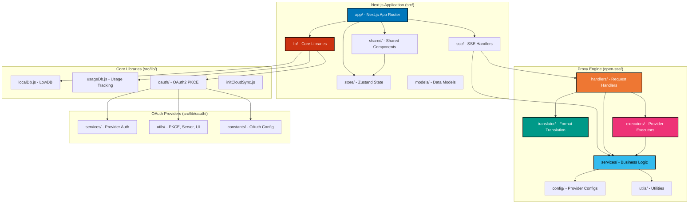
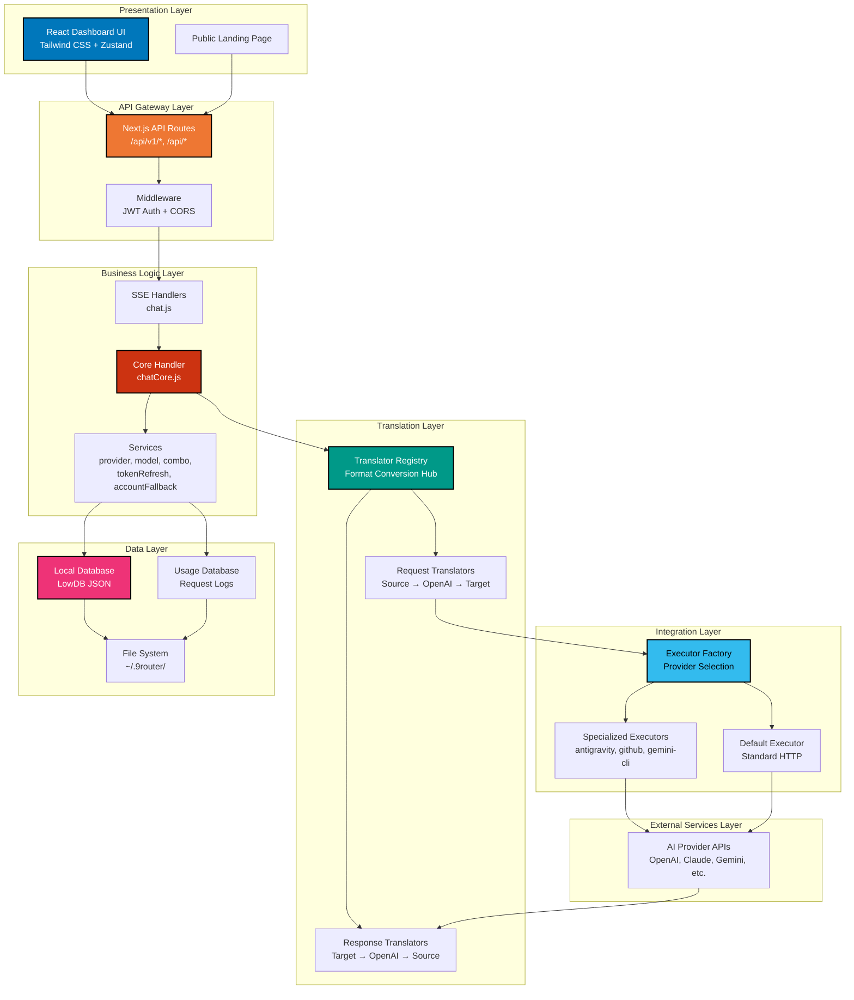
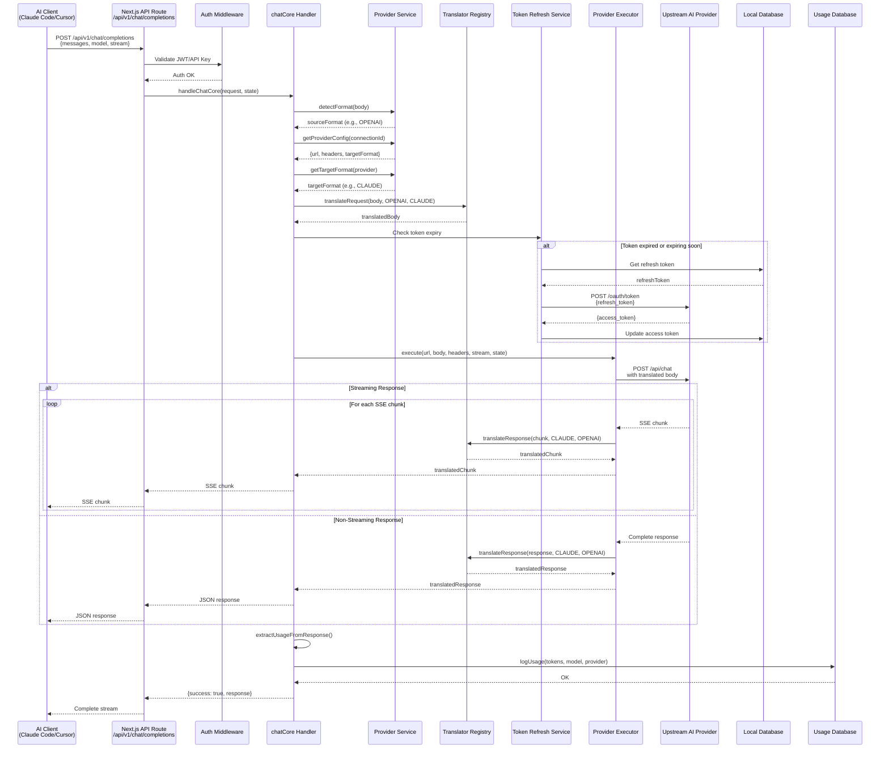
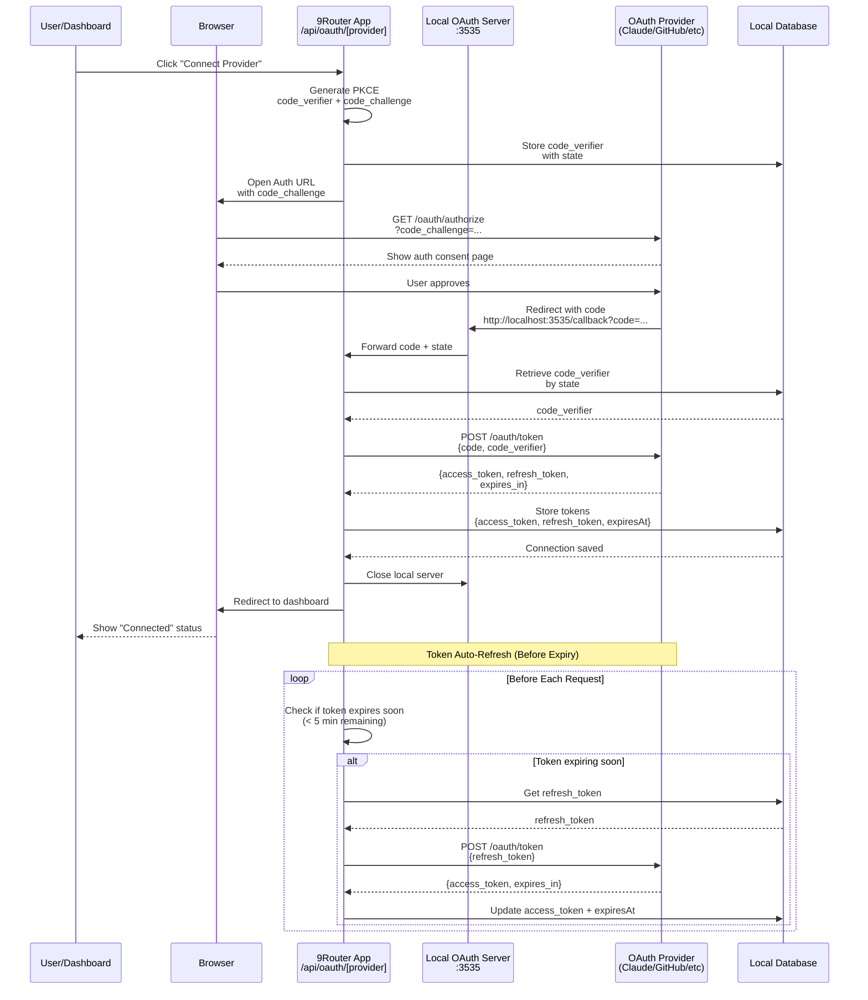

# Architecture Overview

## High-Level Structure

The application is split into two main layers:

1. **Proxy Engine** (`open-sse/`): Core translation and routing logic (provider-agnostic)
2. **Next.js App** (`src/`): Dashboard UI and API routes

---

## 1. Package/Module Structure

This diagram shows the main packages and their dependencies in the 9Router system:



---

## 2. Layered Architecture

This diagram illustrates the layered architecture showing separation of concerns:



---

## 3. Request Flow Sequence Diagram

This sequence diagram shows the complete flow of a chat request through the system:



---

## 4. OAuth PKCE Authentication Flow

This diagram shows the OAuth 2.0 with PKCE flow used for provider authentication:



---

## 5. Database Schema

This diagram shows the LowDB JSON database structure:

```mermaid
erDiagram
    DATABASE ||--o{ PROVIDER_CONNECTIONS : contains
    DATABASE ||--o{ MODEL_ALIASES : contains
    DATABASE ||--o{ COMBOS : contains
    DATABASE ||--o{ API_KEYS : contains
    DATABASE ||--|| SETTINGS : contains
    DATABASE ||--|| PRICING : contains

    DATABASE {
        string location "~/.9router/db.json"
        string encoding "utf-8"
    }

    PROVIDER_CONNECTIONS {
        string id PK "UUID"
        string name "Display name"
        string provider "Provider key (claude/openai/etc)"
        string type "oauth|apiKey"
        string accessToken "OAuth access token"
        string refreshToken "OAuth refresh token"
        number expiresAt "Token expiry timestamp"
        string apiKey "API key (for non-OAuth)"
        object metadata "Provider-specific data"
        number priority "Fallback order"
        boolean enabled "Active status"
        string createdAt "ISO timestamp"
        string updatedAt "ISO timestamp"
    }

    MODEL_ALIASES {
        string aliasName "Custom model name"
        string targetModel "Actual model name"
        string provider "Provider key"
    }

    COMBOS {
        string id PK "UUID"
        string name "Combo name"
        array models "Model fallback chain"
        boolean enabled "Active status"
        string createdAt "ISO timestamp"
        string updatedAt "ISO timestamp"
    }

    API_KEYS {
        string id PK "UUID"
        string key "API key (9r_...)"
        string shortKey "Display key (last 8 chars)"
        string name "Key name"
        string createdAt "ISO timestamp"
    }

    SETTINGS {
        boolean cloudEnabled "Cloud sync enabled"
        string cloudUrl "Cloud API URL"
        string cloudToken "Cloud auth token"
        object thinkingConfig "AI thinking configuration"
    }

    PRICING {
        object models "Model pricing config"
    }

    USAGE_DATABASE ||--o{ USAGE_LOGS : contains

    USAGE_DATABASE {
        string location "~/.9router/usage-*.json"
        string pattern "Monthly rotation"
    }

    USAGE_LOGS {
        string id PK "UUID"
        string timestamp "ISO timestamp"
        string connectionId "Provider connection ID"
        string provider "Provider name"
        string model "Model used"
        number promptTokens "Input tokens"
        number completionTokens "Output tokens"
        number totalTokens "Total tokens"
        number cost "Calculated cost"
        string sourceFormat "Request format"
        string targetFormat "Provider format"
        boolean success "Request success"
        number status "HTTP status"
    }
```



---

## 6. Component Interaction Diagram

This diagram shows how the main components interact during request processing:

```mermaid
graph TB
    subgraph "API Entry Points"
        CHAT_API[/api/v1/chat/completions]
        MESSAGES_API[/api/v1/messages]
        RESPONSES_API[/api/v1/responses]
    end

    subgraph "Request Processing"
        CHAT_HANDLER[chatCore.js<br/>Main Handler]
        FORMAT_DETECT[detectFormat()<br/>Detect client format]
        PROVIDER_RESOLVE[getProviderConfig()<br/>Resolve provider]
        MODEL_RESOLVE[resolveModel()<br/>Handle aliases & combos]
    end

    subgraph "Translation System"
        TRANS_REG[Translator Registry]
        REQ_TRANS[Request Translator]
        RES_TRANS[Response Translator]

        subgraph "Translation Helpers"
            TOOL_HELPER[Tool Call Helper]
            TOKEN_HELPER[Max Tokens Helper]
            SYSTEM_HELPER[System Prompt Helper]
        end
    end

    subgraph "Token Management"
        TOKEN_CHECK[isTokenExpiringSoon()]
        TOKEN_REFRESH[refreshToken()]
        TOKEN_STORE[Update DB Tokens]
    end

    subgraph "Execution Strategy"
        EXEC_FACTORY[getExecutor()]

        subgraph "Executors"
            ANTI_EXEC[AntigravityExecutor<br/>Claude special features]
            GITHUB_EXEC[GitHubExecutor<br/>Copilot OAuth]
            GEMINI_EXEC[GeminiCLIExecutor<br/>CLI integration]
            DEFAULT_EXEC[DefaultExecutor<br/>Standard HTTP]
        end
    end

    subgraph "Fallback & Retry"
        FALLBACK_CHECK[checkFallbackError()]
        ACCOUNT_FILTER[filterAvailableAccounts()]
        COOLDOWN[Account Cooldown Logic]
        COMBO_FALLBACK[Combo Model Fallback]
    end

    subgraph "Response Handling"
        STREAM_HANDLER[Stream Handler]
        USAGE_EXTRACT[extractUsageFromResponse()]
        USAGE_LOG[Log to Usage DB]
    end

    CHAT_API --> CHAT_HANDLER
    MESSAGES_API --> CHAT_HANDLER
    RESPONSES_API --> CHAT_HANDLER

    CHAT_HANDLER --> FORMAT_DETECT
    CHAT_HANDLER --> PROVIDER_RESOLVE
    CHAT_HANDLER --> MODEL_RESOLVE

    MODEL_RESOLVE --> COMBO_FALLBACK

    CHAT_HANDLER --> TRANS_REG
    TRANS_REG --> REQ_TRANS
    REQ_TRANS --> TOOL_HELPER
    REQ_TRANS --> TOKEN_HELPER
    REQ_TRANS --> SYSTEM_HELPER

    CHAT_HANDLER --> TOKEN_CHECK
    TOKEN_CHECK -->|Expired| TOKEN_REFRESH
    TOKEN_REFRESH --> TOKEN_STORE

    CHAT_HANDLER --> EXEC_FACTORY
    EXEC_FACTORY --> ANTI_EXEC
    EXEC_FACTORY --> GITHUB_EXEC
    EXEC_FACTORY --> GEMINI_EXEC
    EXEC_FACTORY --> DEFAULT_EXEC

    DEFAULT_EXEC -->|Error| FALLBACK_CHECK
    FALLBACK_CHECK -->|Should Fallback| ACCOUNT_FILTER
    ACCOUNT_FILTER --> COOLDOWN
    COOLDOWN -->|Retry| EXEC_FACTORY

    FALLBACK_CHECK -->|Combo Fallback| COMBO_FALLBACK
    COMBO_FALLBACK -->|Next Model| CHAT_HANDLER

    DEFAULT_EXEC -->|Success| RES_TRANS
    RES_TRANS --> STREAM_HANDLER
    STREAM_HANDLER --> USAGE_EXTRACT
    USAGE_EXTRACT --> USAGE_LOG

    style CHAT_HANDLER fill:#CC3311,stroke:#000,stroke-width:2px,color:#fff
    style TRANS_REG fill:#009988,stroke:#000,stroke-width:2px,color:#fff
    style EXEC_FACTORY fill:#EE7733,stroke:#000,stroke-width:2px,color:#fff
    style FALLBACK_CHECK fill:#33BBEE,stroke:#000,stroke-width:2px,color:#000
    style STREAM_HANDLER fill:#0077BB,stroke:#000,stroke-width:2px,color:#fff
```

---

## 7. Deployment Architecture

This diagram shows how 9Router can be deployed in different environments:

```mermaid
graph TB
    subgraph "Client Applications"
        CLAUDE[Claude Code CLI]
        CURSOR[Cursor IDE]
        CODEX[OpenAI Codex]
        CLINE[Cline VSCode]
        OTHER[Other AI Tools]
    end

    subgraph "9Router Deployment Options"
        subgraph "Local Deployment (Standalone)"
            LOCAL_APP[Next.js Server<br/>Port 3000]
            LOCAL_DB[(Local Database<br/>~/.9router/db.json)]
            LOCAL_USAGE[(Usage Logs<br/>~/.9router/usage-*.json)]
        end

        subgraph "VPS Deployment (Server)"
            VPS_APP[Next.js Server<br/>Port 3000/443]
            VPS_DB[(Database<br/>/var/9router/db.json)]
            VPS_USAGE[(Usage Logs<br/>/var/9router/usage-*.json)]
            REVERSE_PROXY[Nginx/Caddy<br/>Reverse Proxy]
            SSL[SSL/TLS<br/>Let's Encrypt]
        end
    end

    subgraph "AI Provider APIs"
        OPENAI_API[OpenAI API<br/>api.openai.com]
        CLAUDE_API[Claude API<br/>api.anthropic.com]
        GEMINI_API[Gemini API<br/>generativelanguage.googleapis.com]
        GITHUB_API[GitHub Copilot<br/>api.githubcopilot.com]
        DEEPSEEK_API[DeepSeek API]
        QWEN_API[Qwen API]
        OLLAMA_API[Ollama Local]
    end

    subgraph "Cloud Services (Optional)"
        CLOUD_SYNC[9Router Cloud<br/>Sync Service]
        CLOUD_BACKUP[Cloud Backup<br/>Config & Usage]
    end

    CLAUDE -->|HTTPS| LOCAL_APP
    CURSOR -->|HTTPS| LOCAL_APP
    CODEX -->|HTTPS| LOCAL_APP
    CLINE -->|HTTPS| VPS_APP
    OTHER -->|HTTPS| VPS_APP

    LOCAL_APP --> LOCAL_DB
    LOCAL_APP --> LOCAL_USAGE
    VPS_APP --> VPS_DB
    VPS_APP --> VPS_USAGE

    REVERSE_PROXY --> VPS_APP
    SSL --> REVERSE_PROXY

    LOCAL_APP -->|OAuth/API Key| OPENAI_API
    LOCAL_APP -->|OAuth/API Key| CLAUDE_API
    LOCAL_APP -->|OAuth/API Key| GEMINI_API
    LOCAL_APP -->|OAuth| GITHUB_API
    LOCAL_APP -->|API Key| DEEPSEEK_API
    LOCAL_APP -->|OAuth| QWEN_API
    LOCAL_APP -->|HTTP| OLLAMA_API

    VPS_APP -->|OAuth/API Key| OPENAI_API
    VPS_APP -->|OAuth/API Key| CLAUDE_API
    VPS_APP -->|OAuth/API Key| GEMINI_API
    VPS_APP -->|OAuth| GITHUB_API
    VPS_APP -->|API Key| DEEPSEEK_API
    VPS_APP -->|OAuth| QWEN_API

    LOCAL_APP -.->|Optional| CLOUD_SYNC
    VPS_APP -.->|Optional| CLOUD_SYNC
    CLOUD_SYNC -.-> CLOUD_BACKUP

    style LOCAL_APP fill:#0077BB,stroke:#000,stroke-width:2px,color:#fff
    style VPS_APP fill:#EE7733,stroke:#000,stroke-width:2px,color:#fff
    style LOCAL_DB fill:#EE3377,stroke:#000,stroke-width:2px,color:#fff
    style VPS_DB fill:#EE3377,stroke:#000,stroke-width:2px,color:#fff
    style REVERSE_PROXY fill:#009988,stroke:#000,stroke-width:2px,color:#fff
    style SSL fill:#33BBEE,stroke:#000,stroke-width:2px,color:#000
```



---

## Core Components

### 1. Translator Layer (`open-sse/translator/`)
Registry-based format translation system that converts between AI provider formats.

**Pattern**: All translations go through OpenAI format as intermediate
- Request: `Source → OpenAI → Target`
- Response: `Target → OpenAI → Source`

**Key Files**:
- `index.js`: Registry and translation orchestration, manages `requestRegistry` and `responseRegistry`
- `formats.js`: Format constants (OPENAI, CLAUDE, GEMINI, RESPONSES_API, OLLAMA)
- `request/*.js`: Request translators (5 translators for bidirectional conversion)
- `response/*.js`: Response translators (handle streaming chunks with state maintenance)
- `helpers/*.js`: Shared translation utilities (tool calls, max tokens, system prompts)

**Translation State**: The `initState()` function maintains state across streaming chunks including:
- `funcCallIds`, `funcNames`, `funcArgsBuf` - Tool call tracking
- `msgTextBuf`, `msgItemAdded` - Message assembly
- `reasoningBuf`, `inThinking` - Extended thinking mode
- `seq`, `created`, `started` - Stream metadata

### 2. Handler Layer (`open-sse/handlers/`)
Core request handling logic.

- `chatCore.js`: Main chat handler shared between SSE and Workers
  - Handles format detection, translation, token refresh, streaming
  - Returns `{ success, response, status, error }` for fallback logic
  - Tracks usage and logs requests via `extractUsageFromResponse()`
  - Implements retry logic with account fallback

### 3. Executor Pattern (`open-sse/executors/`)
Provider-specific API execution strategies.

- `base.js`: Base executor class with common logic
- `default.js`: Standard HTTP executor for most providers (uses undici for performance)
- `antigravity.js`: Claude-specific executor with extended thinking and special features
- `github.js`: GitHub Copilot OAuth handling with header injection
- `gemini-cli.js`: Gemini CLI-specific logic for local CLI integration
- `index.js`: Executor registry (`executors` map) and factory (`getExecutor()`)

**Pattern**: Each executor implements `execute(url, body, headers, stream, state)` and handles provider-specific quirks.

### 4. Services (`open-sse/services/`)
Reusable business logic.

- `provider.js`: Provider config resolution, URL/header building, format detection
  - `getProviderConfig()` - Resolves connection and config
  - `buildProviderUrl()` - Constructs API endpoint
  - `buildProviderHeaders()` - Builds auth headers
  - `detectFormat()` - Identifies request format from body structure
- `model.js`: Model alias resolution, combo model parsing
- `tokenRefresh.js`: OAuth token refresh for all providers with `isTokenExpiringSoon()` check
- `accountFallback.js`: Account unavailability tracking and cooldown logic
  - `checkFallbackError()` - Determines if error requires fallback
  - `filterAvailableAccounts()` - Filters out unavailable accounts
  - `applyErrorState()` - Marks account as unavailable with backoff
  - `getQuotaCooldown()` - Calculates exponential backoff (5min → 15min → 1hr → 6hr → 24hr)
- `combo.js`: Multi-model fallback handling for combo chains
- `usage.js`: Usage tracking utilities

### 5. Next.js App (`src/app/`)
Dashboard and API routes using App Router (Next.js 15).

**API Routes Structure**:
- `api/v1/chat/completions/` - OpenAI-compatible chat endpoint
- `api/v1/messages/` - Claude-compatible messages endpoint
- `api/v1/responses/` - Responses API endpoint
- `api/providers/` - Provider CRUD operations
- `api/combos/` - Combo management
- `api/oauth/[provider]/[action]/` - Dynamic OAuth flow handler
- `api/keys/` - API key management
- `api/usage/` - Usage analytics
- `api/settings/` - Global settings

**Dashboard Pages**:
- `dashboard/` - Main dashboard overview
- `dashboard/providers/` - Provider connections management
- `dashboard/combos/` - Combo configuration
- `dashboard/endpoint/` - Endpoint configuration for CLI tools
- `dashboard/cli-tools/` - CLI tool-specific settings
- `dashboard/settings/pricing/` - Pricing configuration

**URL Rewrites**: `next.config.mjs` maps `/v1/*` to `/api/v1/*` for compatibility with AI clients.

### 6. Database (`src/lib/localDb.js`)
JSON file-based database using LowDB v7.

**Location**: Platform-specific paths
- Linux/macOS: `~/.9router/db.json`
- Windows: `%APPDATA%/9router/db.json`

**Key Functions**:
- `getDb()` - Singleton database instance with auto-initialization
- `createProviderConnection()`, `updateProviderConnection()`, `deleteProviderConnection()`
- `getProviderConnectionById()`, `getProviderConnections()` - With filtering and sorting
- `createCombo()`, `updateCombo()`, `deleteCombo()`, `getComboById()`, `getComboByName()`
- `createApiKey()`, `deleteApiKey()`, `validateApiKey()` - JWT-based API keys
- `setModelAlias()`, `deleteModelAlias()`, `getModelAliases()`
- `updateSettings()`, `getSettings()` - Global configuration
- `updatePricing()`, `getPricing()`, `getPricingForModel()` - Pricing management
- `reorderProviderConnections()` - Priority-based sorting for fallback

**Schema** (see Database Schema diagram above)

**Usage Tracking**: Separate `usageDb.js` handles request logs with monthly rotation pattern (`usage-YYYY-MM.json`).

### 7. OAuth (`src/lib/oauth/`)
OAuth2 PKCE flow implementation for providers.

**Architecture**:
- `services/oauth.js`: Base `OAuthService` class implementing PKCE flow
  - `startAuthFlow()` - Initiates OAuth with code challenge
  - `buildAuthUrl()` - Constructs authorization URL
  - `exchangeCode()` - Exchanges authorization code for tokens
- `services/claude.js`, `services/github.js`, `services/gemini.js`, etc. - Provider-specific implementations extending `OAuthService`
- `utils/pkce.js` - PKCE code verifier and challenge generation
- `utils/server.js` - Local callback server (port 3535) for OAuth redirects
- `utils/ui.js` - Terminal UI for OAuth flow feedback
- `constants/oauth.js` - OAuth endpoints and configuration

**Pattern**:
1. Generate code_verifier + code_challenge (PKCE)
2. Start local server on port 3535
3. Open browser to provider's authorization URL
4. Provider redirects to localhost:3535 with code
5. Exchange code + code_verifier for tokens
6. Store tokens in database
7. Auto-refresh tokens before expiry

## State Management (Frontend)

Zustand stores (`src/store/`):
- `providerStore.js`: Provider connections state and operations
- `userStore.js`: User authentication state (JWT-based)
- `themeStore.js`: UI theme preferences (light/dark mode)

**Pattern**: Stores expose actions that call API routes and update state atomically.

## Key Design Patterns

1. **Format Translation Registry**:
   - Register translators with `register(from, to, requestFn, responseFn)`
   - All formats convert through OpenAI as intermediate (star topology)
   - Supports streaming with stateful transform streams

2. **Executor Pattern**:
   - Provider-specific logic isolated in executors
   - Factory pattern (`getExecutor()`) selects executor based on provider
   - Base class provides common functionality (streaming, error handling)

3. **Account Fallback**:
   - Automatic retry with different accounts on rate limit/error
   - Exponential backoff with cooldown periods (5min → 24hr)
   - Account unavailability tracking per provider
   - Status tracking: `available`, `rate_limited`, `error`, `quota_exceeded`

4. **Combo System**:
   - Multi-model fallback chains (e.g., `gpt-4o,claude-3.5-sonnet,gemini-2.0-flash`)
   - Tries models in order until success
   - Respects account availability and cooldown
   - Supports model aliases in combo chains

5. **SSE Streaming**:
   - Transform streams maintain translation state across chunks
   - State includes message assembly, tool calls, thinking mode
   - Proper cleanup and error handling
   - Compatible with undici fetch for high performance

6. **Token Management**:
   - Proactive refresh before expiry (5 minutes threshold)
   - Refresh tokens stored securely in local database
   - Provider-specific refresh logic in `tokenRefresh.js`
   - Auto-retry on token refresh failure

## Directory Structure

```
9router/
├── src/
│   ├── app/                    # Next.js App Router
│   │   ├── api/                # API routes
│   │   │   ├── v1/             # v1 API (chat, messages, responses)
│   │   │   ├── providers/      # Provider CRUD
│   │   │   ├── combos/         # Combo management
│   │   │   ├── oauth/          # OAuth flow
│   │   │   ├── keys/           # API key management
│   │   │   └── usage/          # Usage analytics
│   │   ├── dashboard/          # Dashboard pages
│   │   ├── login/              # Auth pages
│   │   └── landing/            # Landing page
│   ├── lib/                    # Core libraries
│   │   ├── localDb.js          # LowDB database
│   │   ├── usageDb.js          # Usage tracking
│   │   ├── oauth/              # OAuth2 PKCE
│   │   │   ├── services/       # Provider OAuth handlers
│   │   │   ├── utils/          # PKCE, server, UI
│   │   │   └── constants/      # OAuth config
│   │   └── usage/              # Usage fetchers
│   ├── shared/                 # Shared components
│   │   ├── components/         # React components
│   │   ├── constants/          # App constants
│   │   ├── utils/              # Utility functions
│   │   └── hooks/              # React hooks
│   ├── store/                  # Zustand state
│   ├── sse/                    # SSE handlers (bridge to open-sse)
│   └── models/                 # Data models
├── open-sse/                   # Core proxy engine
│   ├── translator/             # Format translation
│   │   ├── request/            # Request translators (5 files)
│   │   ├── response/           # Response translators (5 files)
│   │   └── helpers/            # Translation helpers (6 files)
│   ├── handlers/               # Request handlers
│   │   ├── chatCore.js         # Main chat handler
│   │   └── responsesHandler.js # Responses API handler
│   ├── services/               # Business logic
│   │   ├── provider.js         # Provider config & detection
│   │   ├── model.js            # Model resolution
│   │   ├── tokenRefresh.js     # Token management
│   │   ├── accountFallback.js  # Fallback logic
│   │   ├── combo.js            # Combo handling
│   │   ├── usage.js            # Usage tracking
│   │   └── compact.js          # Response compaction
│   ├── executors/              # Provider executors
│   │   ├── base.js             # Base executor
│   │   ├── default.js          # Standard HTTP
│   │   ├── antigravity.js      # Claude-specific
│   │   ├── github.js           # GitHub Copilot
│   │   └── gemini-cli.js       # Gemini CLI
│   ├── config/                 # Provider configs
│   │   ├── providerModels.js   # Provider model lists
│   │   ├── ollamaModels.js     # Ollama model configs
│   │   └── constants.js        # Config constants
│   ├── utils/                  # Utilities
│   │   ├── streamHandler.js    # Stream processing
│   │   ├── requestLogger.js    # Request logging
│   │   └── error.js            # Error handling
│   └── transformer/            # Special transformers
│       └── responsesTransformer.js # Responses API transform
├── public/                     # Static assets
├── .serena/                    # Serena MCP memories
├── package.json                # Dependencies
├── next.config.mjs             # Next.js config (URL rewrites)
├── jsconfig.json               # Path aliases (@/ → src/)
└── postcss.config.mjs          # Tailwind CSS config
```

## Request Flow (Detailed)

```
1. Client Request
   ↓
2. Next.js API Route (/api/v1/chat/completions, /messages, /responses)
   ↓
3. Middleware (JWT validation from Authorization header)
   ↓
4. SSE Handler (/src/sse/handlers/chat.js)
   ↓
5. chatCore Handler (/open-sse/handlers/chatCore.js)
   ├─→ detectFormat() - Identify source format (OpenAI/Claude/Gemini/Responses/Ollama)
   ├─→ getProviderConfig() - Resolve provider connection and config
   ├─→ resolveModel() - Handle model aliases and combo parsing
   ├─→ getTargetFormat() - Determine provider's expected format
   ↓
6. Request Translation (/open-sse/translator/)
   └─→ translateRequest(body, sourceFormat, targetFormat)
       ├─→ Source → OpenAI (if source != OpenAI)
       └─→ OpenAI → Target (if target != OpenAI)
   ↓
7. Token Refresh Check (/open-sse/services/tokenRefresh.js)
   └─→ isTokenExpiringSoon() - Check if token expires within 5 minutes
       └─→ refreshToken() - Exchange refresh_token for new access_token
   ↓
8. Executor Selection (/open-sse/executors/)
   └─→ getExecutor(provider) - Factory selects appropriate executor
       ├─→ AntigravityExecutor (for Claude with extended thinking)
       ├─→ GitHubExecutor (for GitHub Copilot OAuth)
       ├─→ GeminiCLIExecutor (for Gemini CLI)
       └─→ DefaultExecutor (standard HTTP for others)
   ↓
9. Upstream API Call
   └─→ executor.execute(url, body, headers, stream, state)
       └─→ undici.fetch() - High-performance HTTP client
   ↓
10. Response Handling
    ├─→ Streaming: Transform stream with translateResponse() for each chunk
    │   └─→ State maintained across chunks (message assembly, tool calls)
    └─→ Non-streaming: Translate complete response
   ↓
11. Response Translation (/open-sse/translator/)
    └─→ translateResponse(response, targetFormat, sourceFormat)
        ├─→ Target → OpenAI (if target != OpenAI)
        └─→ OpenAI → Source (if source != OpenAI)
   ↓
12. Usage Tracking (/open-sse/services/usage.js)
    └─→ extractUsageFromResponse() - Extract token counts
        └─→ Log to usageDb.js (monthly rotation)
   ↓
13. Error Handling & Fallback (/open-sse/services/accountFallback.js)
    └─→ checkFallbackError(error) - Determine if should fallback
        ├─→ Rate limit → Apply cooldown, try next account
        ├─→ Quota exceeded → Apply cooldown, try next account
        └─→ Account error → Mark unavailable, try next account
        └─→ Combo fallback → Try next model in combo chain
   ↓
14. SSE Stream to Client + Response
    └─→ Server-Sent Events (SSE) format
        └─→ data: {chunk}\n\n
```

## Performance Optimizations

1. **Undici HTTP Client**: High-performance HTTP/1.1 client (faster than node-fetch)
2. **Transform Streams**: Efficient streaming with minimal memory overhead
3. **Singleton Database**: LowDB instance reused across requests
4. **Connection Pooling**: Executor instances cached per provider
5. **Lazy Loading**: Translators registered on-demand
6. **Monthly Log Rotation**: Usage logs rotated monthly to prevent file bloat

## Security Considerations

1. **Token Storage**: OAuth tokens stored in local filesystem (not in code/repo)
2. **JWT Authentication**: Dashboard protected with JWT tokens
3. **API Key Validation**: Custom API keys (`9r_*`) validated on each request
4. **PKCE Flow**: OAuth2 with PKCE prevents authorization code interception
5. **Secure Token Refresh**: Refresh tokens stored separately from access tokens
6. **Rate Limit Handling**: Exponential backoff prevents provider API abuse
7. **Input Validation**: Request bodies validated before translation
8. **Error Message Sanitization**: Provider errors sanitized before logging

## Scalability Notes

1. **Horizontal Scaling**: Each instance runs independently with local database
2. **Cloud Sync (Optional)**: Multi-instance sync via cloud service
3. **Account Rotation**: Multiple accounts per provider for load distribution
4. **Combo Fallback**: Automatic load distribution across providers
5. **Usage Tracking**: Efficient monthly log rotation for long-term analytics
